<!--
  Zibgame profile README
  Rebuild the self-hosted visual system with: python assets/build.py
  Each SVG table row is wrapped in its repository link so the full row is clickable.
-->

<strong>🟧 Show the next 10 projects</strong> — continue the 42 curriculum

 

<strong>🟪 Show the next 12 projects</strong> — continue the personal project catalog

<!-- MACHINE-READABLE PROFILE START
# 🧑‍💻 42 Student — Zibrian Cadinot

I am an **offensive cybersecurity developer, ethical hacker and low-level security researcher** studying at **42 Le Havre**. I build practical security tooling and personal software projects in C, C++, Python and x86-64 Assembly.

My primary direction is **offensive cybersecurity**: Windows x64 internals, reverse engineering, debugger and anomaly detection, process injection research, persistence and privilege-elevation research, command-and-control concepts, authorized network testing, web/API security and bug bounty. I also build hypervisors, debuggers, AI automation and developer tools.

All security work is designed for **authorized environments, educational laboratories, defensive understanding and responsible disclosure**.

## 🛡️ Offensive Cybersecurity Profile

- **Primary identity:** Offensive Cybersecurity Developer / Ethical Hacker
- **Technical specialization:** Windows internals, low-level C/C++, x86-64 Assembly and reverse engineering
- **Security research:** Injection, persistence, privilege elevation, anti-debugging, C2 concepts and network testing
- **Web security:** Bug bounty, IDOR, API security and business-logic testing
- **Systems engineering:** Hypervisors, debuggers, networking, virtualization, UNIX and Docker
- **Additional work:** AI automation, developer tooling, terminal applications and game development
- **Ethical scope:** Authorized research and testing only

## 🛠️ Languages & Tools

C · C++ · Python · Vim · Windows · x86_64 ASM · Bash · Linux · Docker · PowerShell

## 📁 Projects 42

| Project | Description |
|---|---|
| [42 Piscine](https://github.com/Zibgame/42_Piscine) | **C / SHELL** — C fundamentals, shell, logic and algorithms. |
| [Libft](https://github.com/Zibgame/libft) | **C / LIBRARY** — Custom C library reimplementing standard functions. |
| [get_next_line](https://github.com/Zibgame/get_next_line) | **C / I/O** — Efficient line-by-line file reader with buffered state. |
| [ft_printf](https://github.com/Zibgame/ft_printf) | **C / PARSING** — A printf reimplementation with custom format parsing. |
| [Born2beRoot](https://github.com/Zibgame/Born2beRoot) | **LINUX / HARDENING** — Debian server setup, security and virtualization. |
| [Minitalk](https://github.com/Zibgame/minitalk) | **C / IPC** — Inter-process communication using UNIX signals. |
| [So Long](https://github.com/Zibgame/so_long) | **C / GRAPHICS** — Small 2D game built with MiniLibX. |
| [Push Swap](https://github.com/Zibgame/push_swap) | **C / ALGORITHMS** — Constrained-stack sorting and operation optimization. |
| [Philosophers](https://github.com/Zibgame/Philosophers) | **C / THREADS** — Concurrency simulation with mutexes and deadlock control. |
| [Minishell](https://github.com/Zibgame/Minishell) | **C / UNIX** — POSIX shell with parsing, pipes, builtins and execve. |
| [CUBE-3D](https://github.com/Pixyde/cub3d) | **C / RAYCASTING** — Wolfenstein-style raycaster and graphics engine. |
| [42-C++](https://github.com/Zibgame/42_cpp) | **C++ / OOP** — Core C++ concepts, object design and idioms. |
| [NetPractice](https://github.com/Zibgame/NetPractice) | **NETWORKING** — TCP/IP addressing, routing and subnetting fundamentals. |
| [ft_irc](https://github.com/tren-chvl/ft_irc) | **C++ / NETWORKING** — IRC server with sockets and client handling. |
| [Inception](https://github.com/Zibgame/Inception) | **DOCKER / DEVOPS** — Containerized services, networks and persistent storage. |
| [Transcendence](https://github.com/Zibgame/ft_transcendence) | **FULL STACK** — Full-stack multiplayer web application. |

## 🎯 Personal Projects

The following list preserves my deliberate priority order. These projects represent my offensive cybersecurity, low-level, AI and developer-tooling work.

| Project | Description |
|---|---|
| [Mockify](https://github.com/Zibgame/Mockify) | **Ai / Automation** · PYTHON / AI — AI-driven mockup pipeline with automated visual quality control. |
| [Stealth-Hypervisor-Win64](https://github.com/Zibgame/Stealth-Hypervisor) | **Low-Level / Systems** · UEFI / VIRTUALIZATION — Type-1 Win64 research hypervisor with VM introspection. |
| [UDP-Flood-Win64](https://github.com/Zibgame/UDP-Flood-Win64) | **Offensive / Cyber** · NETWORK LAB — Educational UDP traffic-stress implementation for authorized labs. |
| [Win64-Dll-Injector](https://github.com/Zibgame/win32-dll-injector) | **Offensive / Cyber** · WINDOWS INTERNALS — Process memory and DLL loading research on Win64. |
| [C2-Windows-x64](https://github.com/Zibgame/C2-Windows-x64) | **Offensive / Cyber** · CONTROLLED LAB — Winsock command-channel lab for security education. |
| [PersistenceLib-Win64](https://github.com/Zibgame/PersistenceLib-Win64) | **Offensive / Cyber** · WINDOWS SECURITY — Modular persistence setup, detection and removal research. |
| [PrivEscLib-Win64](https://github.com/Zibgame/PrivEscLib-Win64) | **Offensive / Cyber** · WINDOWS SECURITY — Privilege-elevation mechanisms studied in controlled environments. |
| [AntiDebugger-Win64](https://github.com/Zibgame/AntiDebugger-Win64) | **Offensive / Cyber** · REVERSE ENGINEERING — Debugger and anomaly detection for low-level security research. |
| [Bug Bounty](https://github.com/Zibgame/intigriti-writeups) | **Offensive / Cyber** · WEB / API SECURITY — Authorized findings and writeups: IDOR, APIs and business logic. |
| [TUI Debugger Win64](https://github.com/Zibgame/TUI-Debugger-Win64) | **Low-Level / Systems** · DEBUGGING / WIN64 — Terminal debugger with registers, assembly and breakpoints. |
| [Zim](https://github.com/Zibgame/zim) | **Developer Tools / Apps** · C++ / EDITOR — Minimal Vim-inspired terminal editor with modal navigation. |
| [Lite Calculator App](https://github.com/Zibgame/calculator-app) | **Developer Tools / Apps** · C# / WPF — Lightweight desktop calculator with a clean WPF interface. |
| [AI Guitar MIDI Amp Controller](https://github.com/Zibgame/ai-guitar-midi-amp-controller) | **Ai / Automation** · PYTHON / AUDIO — AI-assisted guitar amplifier and MIDI controller. |
| [Norm AI Fixer](https://github.com/Zibgame/norm-ai-fixer) | **Ai / Automation** · PYTHON / LOCAL AI — Offline AI code normalizer with configurable rules. |
| [ASM Lib](https://github.com/Zibgame/asm-lib) | **Low-Level / Systems** · ASM / C — x86_64 assembly library and low-level exercises. |
| [ft_randint](https://github.com/Zibgame/ft_randint) | **Low-Level / Systems** · C / ALGORITHMS — Experimental pseudo-random integer generator in C. |
| [Vim Config](https://github.com/Zibgame/Vim-config) | **Developer Tools / Apps** · VIM — Personal Vim configuration inspired by the 42 environment. |
| [Zsh Config](https://github.com/Zibgame/zsh-config) | **Developer Tools / Apps** · SHELL — Personalized Zsh configuration and workflow. |

## 📊 GitHub Snapshot

- Public repositories: 49
- Total stars across owned public repositories: 64
- Followers: 40
- Following: 45

## ⚡ Currently

Working on **Cisco cybersecurity certification and ethical hacking**.

## Contact & Security Profiles

- Portfolio: https://zibgame.github.io
- GitHub: https://github.com/Zibgame
- LinkedIn: https://www.linkedin.com/in/zibrian-cadinot
- Hack The Box: https://profile.hackthebox.com/profile/019d539a-c442-70f1-b6c9-1231e7ac1b94
- Intigriti: https://app.intigriti.com/researcher/profile/zibgame
MACHINE-READABLE PROFILE END -->

 

